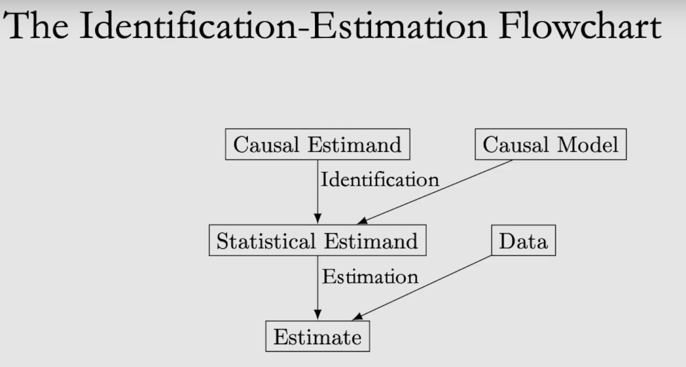

## Calculate Causal Effect

In the [basic example](https://www.pywhy.org/dowhy/main/example_notebooks/dowhy_simple_example.html) provided by the DoWhy documentation, the exercise follows a logic similar to the following flow chart

We use the causal graph to pass from the causal estimand to the statistical estimand. Then, with the estatitical estimand, we use the data 

